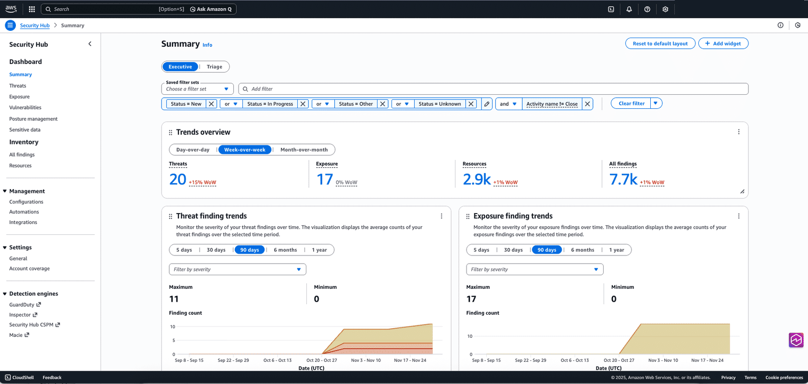

# aws-security-hub-sandbox
AWS Security Hub has been a central place for you to view and aggregate security alerts and compliance status across Amazon Web Services (AWS) accounts. 

### AWS Security Hub
Here’s a quick look at the new AWS Security Hub:

### AWS Integration services
We can integrate other AWS services for centralized management into AWS Security Hub, like:
- Amazon GuardDuty
- Amazon Inspector
- AWS Security Hub CSPM
- Amazon Macie

Security Hub help security teams improve their operational efficiency, by providing centralized management to prioritize critical security issues and respond at scale.