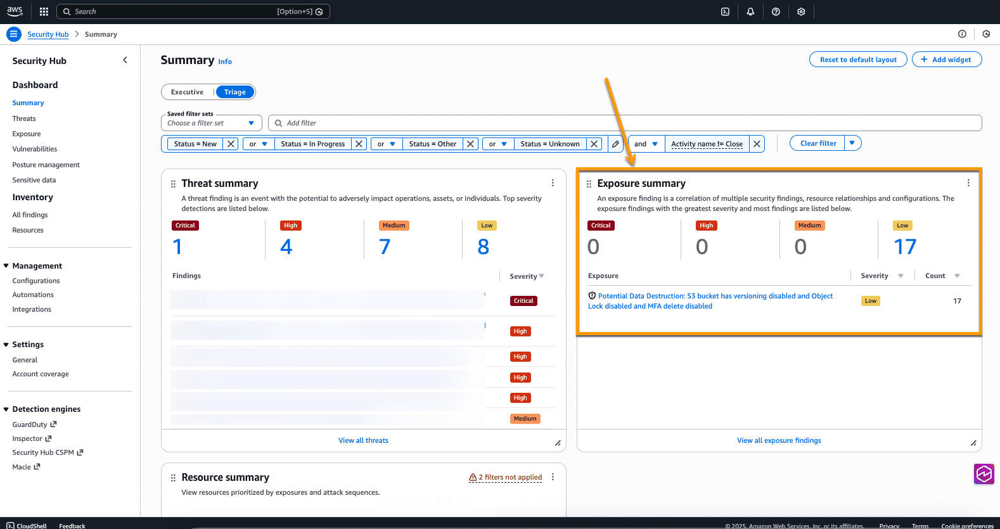
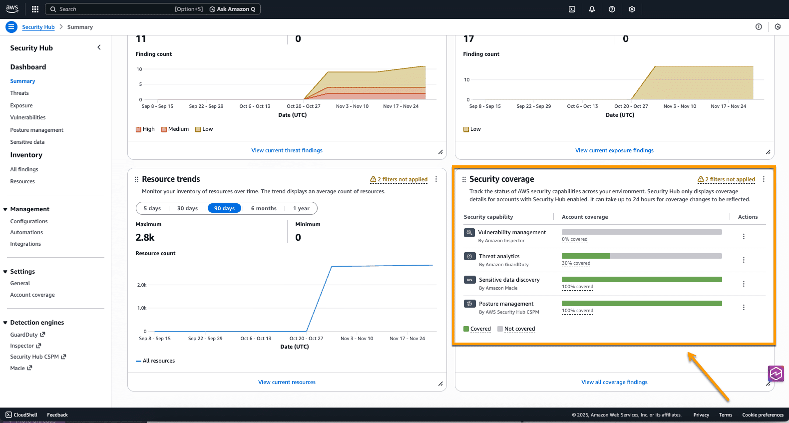
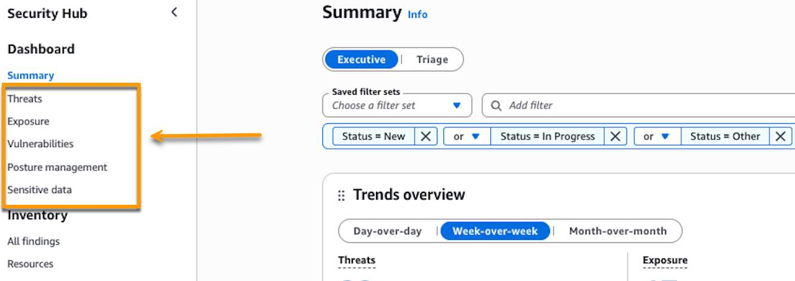

### Security Hub Navegation
 Exposure summarywidget helps you identify and prioritize security exposures by analyzing resource relationships

### Security Coverage
 You can use this widget to identify where you’re missing coverage by the security capabilities that power Security Hub

### Five Areas of Security Hub
Security Hub organizes its findings into five distinct areas to help security teams focus on different aspects of security management. 

